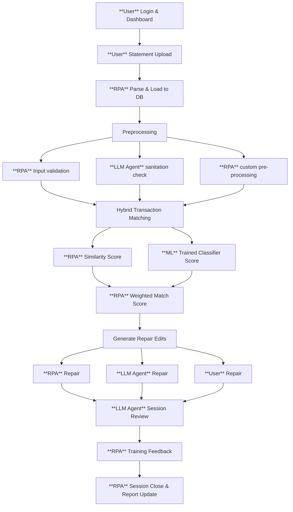

# Case Example: Transaction reconciliation

## Account ledger reconciliation

The aim of the reconciliation process is to reconcile two account ledgers at a transaction level:

- **source of truth**: actual bank statements, which is always lagging due to the limitation of manual MFA for statement downloading. The actual bank statements lack tagging to user specific categories, budget accounts and taxonomy.
- **digital twin**: a user specific ledger, updated in real-time, with transactions tagged with user data model taxonomy.

## Motivation and aims for AI automation

The motivation for automating with AI:

- Current process is 
    - labor intensive, time-consuming
    - Subject to human-error, fatigue
- Largely deterministic and structured, making it a good candidate for AI-assisted automation

## AI RPA Augmented design

- LLMs complement, rather than replace, deterministic RPA
- Hybrid scoring (similarity + classification) balances flexibility and accuracy
- RAG-style repair suggestion helps bridge edge cases
- Manual override is essential for ambiguous or business-critical cases
- Session orchestrators using LangChain can manage multi-step workflows
- Feedback loop enables continual improvement of all agents

## Reconciliation workflow

- Application load
- Statement load to DB
- Pre-processing
- Transaction matching
- Repair edits
- Review feedback
- Application close



### 00 Application load
The user logs in to the application and begins a new session, the state is updated and the application detects the current state and status of reconciliations by month and account. The application guides the user to next steps and issues to resolve if any

### 01 Statement upload
User manually downloads statements as either PDF or Excel compatible (.csv, .xlsx) file format from the bank authenticated using MFA and uploads them using a file uploader UI feature that drops the files to a designated cloud storage location such as an AWS S3 bucket 

### 02 Statement DB load
Robotic Process Automation (RPA) ingests, parses the statements, performs cleanup and formatting and uploads the transaction data to a structured SQL database. 

**AI enhancement** Although a fully RPA process without LLM may suffice for well structured statements, this process could optionally be enhanced with pre and post processing steps added with an LLM Agent to perform pre-upload checks and to review and resolve any processing errors in the first pass statement ingestion. 

**Database** The database can take many types of forms. On AWS, for example, could include RDS, Aurora or even an SQLite DB stored in S3 bucket

### 03 Transaction matching
The transaction matching is the main reconciliation workflow and can include multiple passes and methods, and update with learning as the program is exposed and trained from user input from past reconcilation cases.

**Input validation pre-processing** RPA process performs basic pre-processing input validation for easily detectable data integrity issues such as NULL values in non-NULL fields, duplicate transactions or empty ledgers.

**LLM Agent sanitation pre-processing** LLM Agent has a peek at the data to check for potential problematic cases, perform custom clean-up, formatting, tagging and pre-formatting transactions or run pre-defined clean-up operations not yet built into the RPA pre-processing.

**RPA Special cases pre-processing** Custom pre-processing runs first by RPA process for pre-defined known special cases involving recurring transaction pairs and difficult to handle cases of many-to-many transaction pairs that have been either learned or manually defined by the user.

**transaction pre-processing**: Individual transactions are pre-processed with standard NLP processing to format into standard features [date, account, amount, status, currency, payee, description] remove stopwords, POS tagging, lemmatization, and custom tagging from user-specific model (learned + user-defined)

**Hybrid classification model**: transaction pairs are classified from a hybrid similarity match (no training required) + trained model as either matched or not [0, 1]. The two models (similarity, trained) generate independent scores and the final score is taken as a weighted combination of the two component scores. Over time, the weight of the trained model can be dynamically incremented as accuracy improvement from exposure to more use cases.

**Similarity model**: The similarity model can utilize different methods of similarity matching, each with different trade-offs of computational cost and accuracy. Simple token matching can be performed at high speed and low computational costs, whereas sentence embedding, BERT models can add accuracy boost with a noticeable trade-off in computational costs.

**Trained classification model**: There are many types of standard classification models with Decision tree and Random Forest a good first choice and Neural Networks and Multi-Layered Neural Networks as advanced options.

### 04 Repair edits list
A list of repair edits is generated that will close the reconciliation gap between the ending balance between the reference source-of-truth and the digital twin ledgers.  Each transaction edit is either a REMOVE, ADD or UPDATE.  One fail-safe method for ensuring the process will always generate a solution is to begin with a naive set of edits: REMOVE ALL digital twin txns, ADD ALL source-of-truth, and then remove known matched transactions from the prior transaction matching step pair-wise that sum to zero, ensuring that each step of removed matched transactions preserves the condition of matched ending balance between source-of-truth and digital twin.

**RPA repair**: An RPA process can automatically process repair edits to the digital twin some limited cases of qualified RPA-allowed repairs. Examples of allowed cases may include only amount update by < +/- some threshold amount, or for foreign currency transactions or variable bills which are expected to vary from a range of expected amount in some range.

**LLM Agent review**: An LLM Agent can review the residual edits and follow a set of guidelines to apply repairs not caught by the RPA process, and for residual repairs to propose edits to the user which do not meet the guidelines for Agent repair. These guidelines can be seeded by the user and updated with learning and feedback by the AI Agent.

**Manual repair**: For any residual edits that do not qualify for either RPA or Agent repair, the user is prompted to manually repair either by manually matching transaction with instruction to update the digital twin to match the source-of-truth amount, or by manually updating the digital twin transaction. For example, in case where the transactions were not matched due to a miss-spelling or incorrect transaction category tagging, the user may decide to update the tag and regeneration the edits list in order to prevent corruption of the training model by feeding it bad training feedback cases.  

### 05 Agent session review
An LLM Agent is prompted with the session details, and plans workflow for model, guideline updates.

### 06 Training feedback
The complete set of matched transactions and edit repairs is stored to train each of the models involved, the classifier, the RPA repair and the LLM Agent guide, with specific workflows triggered by the output of the Agent session review.

### 07 Session close
The downstream reports are updated from the updated digital twin and the session status is updated as closed. Any cleanup and logging are recorded to log and record session activity.

## Application Architecture

**Frontend**:

 - User dashboard
 - File upload UI (PDF/CSV/XLSX)
 - Manual repair UI for unmatched or uncertain items

**Session Orchestrator**:

 - Maintains session state
 - Plans workflows
 - Routes feedback to the right learning modules (Classifier, LLM agent, RPA)

**Model Trainer**:

 - incorprates feedback to train and tune models

**Backend** Functional Modules:

 - RPA Parser: Parses bank statements
 - Data Loader: Uploads structured transactions to SQL DB
 - Digital twin API: CRUD DB operations to Digital Twin DB

**Preprocessing Engine**:

 - RPA input validation
 - LLM sanitation and formatting
 - Special-case handlers

**Matching Engine**:

 - Similarity-based matcher (token, embedding, BERT)
 - Trained classifier (Random Forest / MLP)
 - weighted score fusion module
 - weight adapter from experience + classification accuracy

**Repair Engine**:

 - Deduces minimal edit set to align ledgers
 - RPA auto-fixes
 - LLM repair agent
 - Manual override

## Tech stack

- **Cloud**: GitHub, AWS S3, EC2, Lambda
- **Database**: Aurora PostgreSQL or SQLite in S3
- **Embedding Model**: all-MiniLM-L6-v2
- **Vector Store**: FAISS or Qdrant
- **LLM Orchestration**: LangChain agent with tool access and session controller
- **Document loader**: PyPDF, CSV parser, or structured ingest from databases

## Code Snippet Session Orchestration
This snippet provides a simplified conceptual overview of the overall orchestration and not an actual implementation source code

```python
from langchain.agents import AgentExecutor, initialize_agent, Tool
from langchain.agents.agent_types import AgentType
from langchain.llms import OpenAI
from session_utils import *

# Step 1: Define tools the agent can use
tools = [
    Tool(name="load_ledger", func=load_user_ledger, description="Load user ledger"),
    Tool(name="load_bank_stmt", func=load_bank_statement, description="Load bank statement"),
    Tool(name="preprocess", func=preprocess, description="Preprocess both ledgers"),
    Tool(name="match_txns", func=match_txns, description="Match transactions"),
    Tool(name="generate_repairs", func=generate_repairs, description="Generate repair edits"),
    Tool(name="rpa_repair", func=run_rpa_repairs, description="Run RPA repairs"),
    Tool(name="llm_repair", func=run_llm_repairs, description="Run LLM repairs"),
    Tool(name="manual_review", func=manual_review, description="Prompt user for unmatched transactions"),
    Tool(name="check_balances", func=check_balances, description="Check if ledgers are reconciled"),
    Tool(name="process_feedback", func=process_feedback, description="Log and route feedback"),
    Tool(name="update_model", func=update_model, description="Update models with feedback"),
    Tool(name="close_session", func=close_session, description="Close the reconciliation session"),
]

# Step 2: Build the agent
llm = OpenAI(temperature=0)
agent = initialize_agent(
    tools,
    llm,
    agent=AgentType.ZERO_SHOT_REACT_DESCRIPTION,
    verbose=True
)

# Step 3: Execute
agent.run("Begin a session and reconcile the two ledgers. Continue until complete.")

```

## Other use cases

02. Case complaint classification
03. Job search profile matching
04. Personal finances coach
